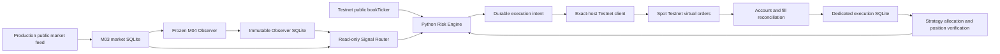

# DEV-E01 integrated M04 Testnet execution

Issue [#5](https://github.com/NAM-GOM/ai-multi-strategy-investment-system/issues/5).
M04 baseline `574eb63597e42724a6450abd0928458ae72c4b88`; pre-existing E01
HEAD `9612b240de917596361b44c7a54a7a21443b34ab`. The integration adds
`trading_system.execution` over the existing audited `trading_system.testnet` engine.
It does not replace verified M01–M04 code or build another strategy engine.

## Repository audit and reuse

GitHub audit found M04 and E01 at the commits above, and E01 already containing
manual execution, HMAC signing, LIMIT sizing, reservations, unknown-order recovery,
fill/balance reconciliation, reset detection and 80 existing Testnet/freeze tests.
M02 PR #3 targets M01, M03 PR #4 targets M02, and unrelated Ponytail PR #6 targets
M03; all were draft/open at audit. No M04/E01 PR was present. The new PR targets
`dev-m04-strategy-observer`; no merge, rebase, force push or other branch rewrite.
Issue #5's earlier manual-only scope is extended by the user's integrated Router
request, while retaining separate approval for actual virtual orders/automation.

`testnet/client.py`, `engine.py` and `risk.py` are reused. The sole existing
application changes are an extension-table allowlist hook in `testnet/store.py`
and rejection of non-integer remote error codes in `testnet/client.py` to prevent
unvalidated remote strings being included in CLI error output.
All 61 protected M01–M04/W03 sources/artifacts remain covered by the original
portable freeze manifest. The M03 and Observer schemas remain unchanged.

## Responsibility boundaries

| Module | Responsibility |
| --- | --- |
| `execution/config.py` | Dedicated credentials and independent execution safety settings |
| `execution/models.py` | Validated Decimal balances, orders and quotes |
| `execution/testnet_client.py` | Reused REST policy, response validation, fixed public Testnet WS quote |
| `execution/signal_router.py` | Immutable M04 reader, provenance/hash verification and signal receipt dedup |
| `execution/risk_engine.py` | Frozen sizing plus separate exchange/experiment limits |
| `execution/order_manager.py` | Reused lifecycle, review token, gates, revalidation, protective stop intent |
| `execution/position_manager.py` | Allocations, cash, reservations, fees, average fill, stop and PnL |
| `execution/reconciliation.py` | Account reconciliation followed by strategy ownership verification |
| `execution/execution_store.py` | Additive dedicated SQLite journal tables/views |
| `execution/cli.py` | Offline defaults, manual commands and explicitly gated one-cycle T1 automation |

M04 imports no execution module. `SignalDecision` remains a condition record.
The Router opens Observer SQLite with `mode=ro`, `query_only`, integrity check and
a coherent read transaction; it never calls `ObserverStore.start/recover/commit`.
M03 is accessed through its existing read-only `MarketRepository`.

## Signal integrity and clock

The first Router initialization commits the existing maximum rowid and activation
time. Both survive restart. Its unique receipt key uses strategy/version/symbol/bar;
its deterministic order ID uses the receipt digest. A global receipt prevents a
previous signal being traded again across execution sessions. No reset advances
historical PnL or replays old signals. Rejected and DRY_RUN signals are consumed;
promotion requires a different new signal. A new session establishes a new floor.

Only complete, COMMITTED nine-decision batches from the current OBSERVING run are
eligible. The Router checks duplicated SQL/record fields, batch hash, manifest,
strategy source/parameter hashes, 4H boundaries and the original M04 `classify`
function. It reads the original W03 warmup plus M03 candles and regenerates the
same decision with the unchanged Frozen adapter. Input/provenance and the full
regenerated record must match. DATA_HOLD, STOP, a stopped/ended run, recovered REST,
prelaunch/historical/Formal modes, future data and stale signals block routing.

ENTRY/EXIT intent submission is allowed only after the closed bar, in the first
60 seconds of the next bar. This enforces next-bar eligibility without claiming a
Binance LIMIT fill equals W03's exact modeled next-open fill. Unsent stale intents
become local `INTENT_EXPIRED`, without inventing an exchange EXPIRED response.
Open GTC orders persist at the exchange; the one-cycle runner isn't a continuous
daemon and cannot guarantee cancellation during PC downtime. Reconciliation and
the pending-order guard precede every later submission. This is an execution
experiment, not W04 performance or identical Frozen paper fills.

T1 alone can submit. T2/T3 remain SHADOW_SIGNAL_ONLY and W03_HOLD. No CLI unlock
exists for T2/T3; adding one needs a separate approval/design with isolated capital.

## Exact network and credential policy

REST is the existing literal `https://testnet.binance.vision` plus the nine allowed
method/path pairs from the request. There is no host/URL/order-type override, proxy
credential fallback or production client mutation. The existing exact-host request
hook enforces HTTPS, port 443, no userinfo, TLS verification and no redirects.
Only `BINANCE_TESTNET_API_KEY` / `BINANCE_TESTNET_API_SECRET` configure Testnet
signing. Integrated configuration additionally refuses values equal to configured
production variables. A key string alone cannot cryptographically prove its origin;
operators must issue dedicated Testnet HMAC keys. There is no production fallback.
Neither application reads secret files or loads the mainnet `.env` for execution.

Signed requests use Testnet server time, recvWindow 5000 and HMAC-SHA256 over the
encoded parameters. No secret, header, signature or signed URL is logged. The
adapter validates responses before the reused engine's identity/fill checks.
HTTP 403/451 and rate limits produce durable holds, without an access bypass.
CI/GITHUB_ACTIONS forbids mutations on the integrated client's real HTTP transport;
MockTransport remains permitted for offline CI. Normal tests reject real HTTP and
the new Testnet WebSocket connector is denied in the new test suite.

The fixed `wss://stream.testnet.binance.vision` bookTicker provides bid/ask with
positive available quantities and update ID. TLS and a five-second read timeout
are enforced; redirects are refused before following. No account keys are sent.
Spot bookTicker has no exchange event timestamp: quote freshness means local receipt
age, not a fabricated source timestamp or independently proven upstream book age.
Fresh Production snapshots require both event and receipt age <=30 seconds.
Testnet quote receipt age <=5 seconds, bid/ask divergence from Production <=2%, and
spread <=0.5% are separate Execution Safety defaults. Violations block orders.

All integrated execution is labeled
`MAINNET_SIGNAL_TESTNET_EXECUTION_EXPERIMENT`. Testnet book/fills do not establish
mainnet execution quality. Demo Mode remains a future, separately credentialed adapter.

## Risk, gates and protective exits

Frozen rules remain EMA50/200, Donchian55/20, TSMOM180, ATR20, initial stop 3 ATR,
0.5% trade risk, 33.3% allocation, 10 bps modeled fee and 5 bps modeled slippage,
long-only, no leverage/pyramiding. Decimal position sizing takes the minimum of
Frozen risk/allocation/cash sizing and execution caps. Actual fills/fees are recorded
as returned by Testnet; model fee/slippage values aren't substituted for them.

Separate limits are <=20 USDT/order, <=3 attempts/UTC day, <=40 USDT/day and <=1
open order, with a conservative 1% funding buffer. Budgets span session changes.
The existing LOT_SIZE, PRICE_FILTER, MIN_NOTIONAL/NOTIONAL, order/rate-limit checks
are reused, with precision/MAX_POSITION validation. MARKET is refused, so
MARKET_LOT_SIZE cannot override LIMIT's LOT_SIZE. Dynamic price filters are checked
by order/test, and changed normalization requires another test. Minimums above the
ceiling block; ceilings are never increased. Attributed orders also require allocated
cash/owned quantity and preserve Frozen caps immediately before submission.

| Gate | Persistent evidence / required unlock |
| --- | --- |
| A | A new valid Router DRY_RUN signal passes hashes, prices and assumed/verified balance sizing; no POST |
| B | Signed read-only reconciliation and order/test succeed for a persisted intent |
| C | Explicit review token + config/CLI unlock submit one manual virtual order; actual returned order subsequently FILLED/CANCELED and reconciled |
| D | A/B/C in the same session, verified allocation, clean reconciliation, dedicated automated env unlock and explicit CLI activation |

The manual review token binds environment, symbol, side, quantity, price, notional,
client ID and limits. A changed intent invalidates it. Test-order validation must be
recent (five minutes) and submission refreshes filters, balances and signal/quotes.
After signing's server-time request, the transport hook rechecks quote/reference
age, next-bar signal age, kill/hold and current M04 health immediately before POST.
No code/mock result marks a live gate passed. A/B/C rows produced by test fixtures
exist only in temporary databases.

PositionManager retains the actual weighted entry fill minus 3 times signal ATR.
During an explicitly enabled cycle, a fresh Production reference below this initial
stop causes a Risk Engine SELL intent owned by T1, distinct from an M04 decision.
The stop uses current bounded Testnet prices and the same risk caps/test-order/
persist-before-send lifecycle. No stop retries or cap bypass are provided. If safety
limits or minimums prevent a protective exit, the cycle fails closed and the operator
must inspect the still-open position. This software cannot guarantee exits while the
PC is off, while feeds are unavailable, or while the experimental budget is exhausted.

## Execution ledger and reconciliation

`data/testnet_execution.sqlite` retains the existing `testnet_sessions`,
`order_intents`, `exchange_orders`, `executions`, `balance_snapshots`,
`reconciliation_events` and `risk_events`. Additive tables are
`strategy_allocations`, `positions`, `signal_receipts`, `router_checkpoints`,
`position_fills`, `execution_gates`; read-only views `execution_sessions`, `fills`,
`balances` expose the requested names without copying records. Decimal values are TEXT.

BEGIN IMMEDIATE / WAL / FULL commits preserve intents/reservations before POST.
UNKNOWN_EXECUTION uses GET by existing identity; no blind POST replay. A commit
failure blocks new requests; an already committed SUBMITTING intent survives ACK
loss. The pre-existing account engine verifies IDs, quantities, paginated fills,
commissions, balance deltas, external orders/trades and missing/reset anchors.

Strategy fill application verifies a sealed projection before adding verified new
fill deltas; it never repairs a corrupted projection. Cash, owned quantity, cost,
weighted gross fill, realized PnL, initial stop and fee-aware unrealized PnL remain
separate from the common account. Reservations derive from active attributed intents
and remaining exchange quantity. T1 claims cannot exceed actual account totals.
Unattributed activity or a third fee asset without an allocation causes
RECONCILIATION_HOLD. Such fees remain recorded in the exchange journal for inspection.

Completed, explicitly approved manual verification fills can be acknowledged as
MANUAL_BASELINE when creating the first T1 quote-capital allocation after a clean
reconciliation. They create no T1 asset position or PnL. Existing faucet/other asset
balances remain unallocated. A new session doesn't inherit allocation, gates or PnL;
the durable kill switch does carry forward. Holds aren't silently cleared. Legacy
manual Store refuses an integrated database's extra tables, preventing a legacy CLI
from bypassing strategy ownership checks on that journal.

## Official specification checked before implementation

Official Binance `testnet/general-info.md` and `testnet/rest-api.md` were read on
2026-10-10. They specify the Testnet `/api` host, periodic unannounced resets,
virtual funds, Test Order without matching-engine execution, HMAC timing and
UNKNOWN execution after backend timeout. This implementation intentionally allows
only the primary requested host, even though official documentation lists another
Testnet host. No `/sapi`, Demo, margin, leverage, transfer or withdrawal adapter exists.

- [Testnet general information](https://github.com/binance/binance-spot-api-docs/blob/master/testnet/general-info.md)
- [Testnet REST specification](https://github.com/binance/binance-spot-api-docs/blob/master/testnet/rest-api.md)
- [Validation evidence and gates](DEV-E01-validation.md)
